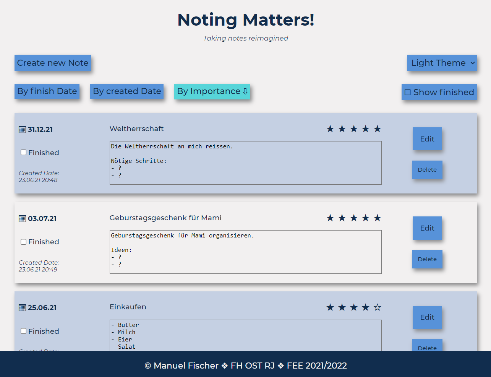
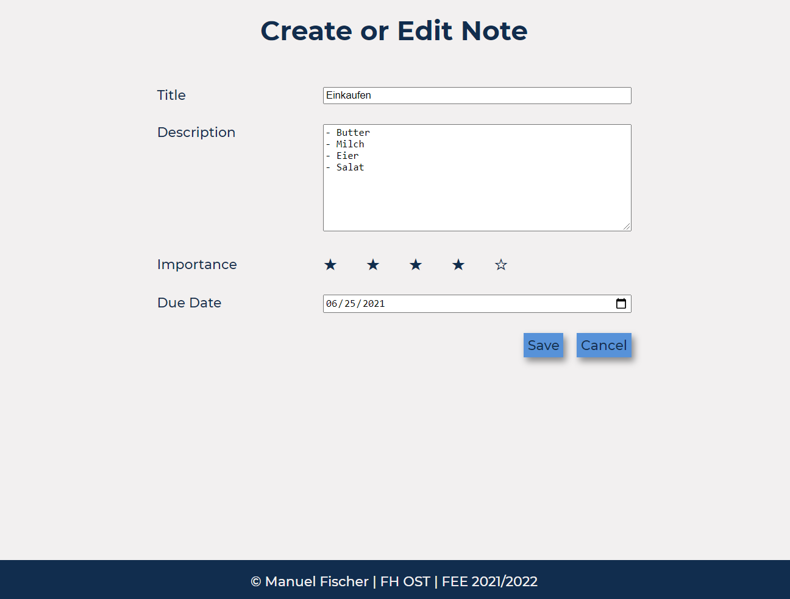

# Noting Matters
Projekt 1 vom CAS FEE an der OST RJ (2021-2022).

## Impressionen

## NPM Befehle
| Befehl  |  Beschreibung |
|---|---|
| npm run stylelint  |   Testet ob die CSS Files in Ordnung sind. |
| npm run w3c  |   Testet ob die HTML Files in Ordnung sind. |
| npm run eslint  |  Testet ob die JS Files in Ordnung sind. |
| npm run all  |   Führt die Tests für CSS/HTML/JS aus. |
| npm run start  |  Started den Web-Server: http://localhost:3001 |
